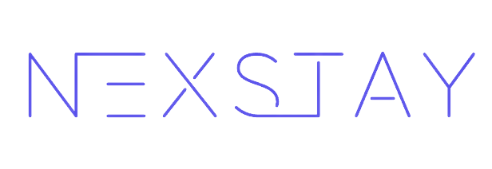

# NEXSTAY
<p align="center">
  
</p>


Experience a paradigm shift in the world of travel with NEXSTAY, an exceptional accommodation system that transcends conventional boundaries. Seamlessly empowering users to create listings and book accommodations while exploring foreign destinations, NEXSTAY goes the extra mile by introducing a captivating Web3 integration. By leveraging blockchain technology and cryptocurrencies, NEXSTAY revolutionizes payment methods, ensuring uncompromised security and enhanced convenience. The innovation doesn't stop there: NEXSTAY introduces a groundbreaking feature allowing users to stream cryptocurrencies, enabling the flexibility of incremental payments rather than the traditional lump-sum approach. Prepare to embark on a transformative journey where cutting-edge technology merges harmoniously with the timeless allure of exploration.

## 🚀 About Me

I'm a a third-year computer science student at Vilnius University, trying to become a full-stack engineer and Web3 developer.

## About project

This is a university project for 3rd year course work, as well as, project system architecture course.

Code base [Github](https://github.com/debe7408/nexstay-web3)

## Features

- Book a place to stay
- Create your own listings and earn
- Connect with Socials or Web3 providers, no passwords required!
- Secure transactions via Smart Contracts
- Streamable payments

## Authors

- Deividas Bendaravičius [@debe7408](https://github.com/debe7408)

## Documentation

[Documentation](https://github.com/debe7408/nexstay-web3/blob/main/Documentation_v2.pdf)

## Before Deployment

#### To deploy this project locally, see README.md of both Frontend and Backend in the corresponding folders.

#### There is also an option to deploy your own smart contract, more on that in the README.md of smart_contracts folder. Otherwise, please use the deployed smart contract, which be viewed on the [BSCSCAN](https://testnet.bscscan.com/address/0x6a81e84c64ae23c6a4dc09714f2e94fa45126248).

Deployment documentation asumes you have Node.js and a package manager such as npm or yarn to install required packages.
However, if you do not follow these steps before deploying any part of the system locally.

Install Node.js from their [official website](https://nodejs.org/en/download) or via the terminal:

```bash
 apt-get install nodejs
```

Node package manager (npm) comes bundled with Node.js. However, if you prefer yarn, you can simply install it in your cli:

```bash
 npm install --global yarn
```

Additionally, in order to be able to clone the repositories and execute other git commands, you will need to install git.

First check if you have git installed already.

```bash
 git --version
```

In case you do not have Git. It can be installed via the cli, or the via the GUI which can be found [here](https://git-scm.com/downloads) according to your OS.

```bash
 apt-get install git
```

## Tech Stack

**Frontend:** React, TypeScript, Redux, MaterialUI, Styled Components,

**Backend:** Node.js, Express.js, TypeScript

**Smart Contracts** Solidity, JavaScript

**APIs:** Web3Auth, Google Maps API

## Contributing

If you would like to contribute to this project, please follow these steps:

1. Fork the repository.
2. Create a new branch with a descriptive name for your feature or bugfix.
3. Commit your changes to the branch.
4. Submit a pull request to the main repository, describing the changes you made and any additional information that might be helpful for reviewers.

Please make sure to update tests as appropriate and follow the code style of the project.

## Support

If you encounter any issues or have questions about the project, feel free to create an issue on GitHub or contact me directly.

## License

[MIT](https://choosealicense.com/licenses/mit/)
